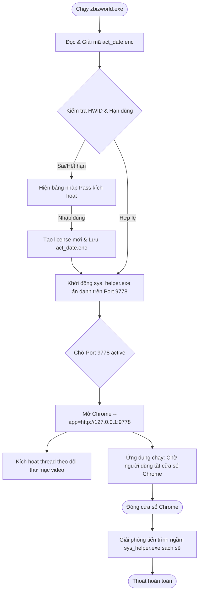

# BẢN TỔNG HỢP KIẾN TRÚC & DỰ ÁN ZBIZWORLD AI GENERATE PRO

Tài liệu này được biên soạn chi tiết nhằm giúp các lập trình viên hoặc các tác nhân AI khác hiểu rõ toàn bộ cấu trúc, kiến trúc hoạt động, lịch sử sửa đổi và quy trình đóng gói của dự án **ZBizWorld AI Generate Pro**.

---

## 1. TỔNG QUAN DỰ ÁN
**ZBizWorld AI Generate Pro** là ứng dụng Windows dùng để sáng tạo và tạo video tự động bằng trí tuệ nhân tạo (AI). 
* **Kiến trúc chính**: Gồm giao diện web (Client-side Nuxt.js) kết hợp với dịch vụ máy chủ ngầm (Backend FastAPI) chạy trực tiếp trên máy người dùng thông qua trình duyệt ứng dụng Chromium thu nhỏ.

---

## 2. BẢN ĐỒ CẤU TRÚC FILE THƯ MỤC (WORKSPACE MAP)
Thư mục làm việc chính trên ổ đĩa của nhà phát triển: `D:\all my code stuff\AI-veo3\AI_Generate_Tool\`

* **`zbizworld.py` / `zbizworld.exe`**: Trình khởi chạy chính (Launcher). Thực hiện xác thực mật khẩu, kiểm tra hạn sử dụng bản quyền, gọi máy chủ ngầm và kích hoạt cửa sổ trình duyệt. Được mã hóa bảo mật bằng **PyArmor** và đóng gói bằng **PyInstaller** thành tệp `.exe` độc lập.
* **`setup.iss`**: Tịch bản cấu hình đóng gói phần mềm cài đặt bằng **Inno Setup Compiler**.
* **`icon.ico` / `Zbiz.ico`**: Ảnh đại diện và Icon của ứng dụng.
* **`storage\`**: Thư mục lưu trữ tài nguyên chạy ngầm của ứng dụng:
  * **`storage\config\`**: Lưu trữ thông tin bản quyền:
    * `act_date.enc`: Ngày kích hoạt, lịch sử chạy cuối cùng và chữ ký HWID phần cứng (được mã hóa).
    * `yt_tool.lic`: Chữ ký số HMAC-SHA256 xác thực bản quyền Pro.
  * **`storage\projects\`**: Thư mục lưu trữ các kịch bản, phân cảnh và video đã kết xuất của người dùng.
  * **`storage\app_chrome_profile\`**: Lưu trữ cache, cookies, và cấu hình các profile Google Chrome để người dùng đăng nhập tài khoản mạng xã hội.
  * **`storage\runtime\bin\`**: Nơi lưu lõi vận hành chính:
    * `sys_helper.exe`: Máy chủ lõi FastAPI chạy ngầm trên cổng mạng `9778` (biên dịch bằng PyInstaller).
    * `backend_launch.log`: Tệp lưu log vận hành của lõi máy chủ ngầm.
    * **`storage\runtime\bin\config\settings.json.enc`**: Tệp lưu trữ cấu hình cá nhân (Gemini key, Proxy, folder xuất video) dưới dạng mã hóa XOR. Nếu tệp này bị xóa, máy chủ sẽ tự động khởi tạo lại cấu hình trắng mặc định.
    * **`storage\runtime\bin\static\`**: Thư mục chứa giao diện tĩnh (HTML/CSS/JS) của Nuxt.js. 
      * Tệp giao diện chính: `static\index.html`.
      * Các file JS logic giao diện chính nằm trong `static\_nuxt\` (đã được nén và obfuscate).

---

## 3. KIẾN TRÚC HOẠT ĐỘNG (FLOW ENGINE)



---

## 4. CÁC TÍNH NĂNG TÙY CHỈNH & BẢN VÁ ĐÃ THỰC HIỆN (CUSTOM FIXES)

### A. Xuất Video Ra Thư Mục Custom Lập Tức
* **Vấn đề**: Mặc định, `sys_helper.exe` kết xuất video vào sâu bên trong thư mục dự án `storage/projects/.../renders`. 
* **Giải pháp**: Bổ sung một luồng chạy nền (thread `watch_and_copy_videos`) trong `zbizworld.py`. Luồng này quét cổng `9778/api/settings` mỗi 2 giây để lấy đường dẫn custom. Khi phát hiện video kết xuất hoàn tất, nó sẽ sao chép tệp video ra thư mục custom ngay lập tức.

### B. Popup Giao Diện Hiển Thị Đúng Thư Mục Custom
* **Vấn đề**: Mặc dù video xuất đúng thư mục, popup thành công trên UI vẫn hiển thị đường dẫn ổ C/D mặc định do backend phản hồi.
* **Giải pháp**:
  * Viết mã giả lập mạng (Network Interceptor) trong `static\index.html` để chặn các yêu cầu GET `/api/settings` và POST `/api/settings/update` nhằm đồng bộ đường dẫn custom thời gian thực vào bộ nhớ `localStorage`.
  * Thay thế hàm hiển thị thông báo thành công trong cả 4 file JS ngôn ngữ (`D2D0Mcrw.js`, `DJL-TxF_.js`, `DYoGbs_D.js`, `G7eZnqFk.js`) sử dụng hàm `window.__get_display_path` để hiển thị đường dẫn custom chính xác trên popup.

### C. Tự Động Sắp Xếp Sidebar (Không cần nhấn F5)
* **Vấn đề**: Khi khởi động, app chuyển từ màn hình Welcome sang màn hình chính bằng cơ chế Nuxt client-side routing nên sự kiện `window.load` không chạy lại, khiến Sidebar giữ nguyên thứ tự cũ lộn xộn.
* **Giải pháp**: Cập nhật tệp `static\index.html` thiết lập kiểm tra định kỳ mỗi `300ms` để tự động sắp xếp lại các mục trên Sidebar (Creator lên đầu, dự án thứ hai...) ngay khi màn hình chính hiển thị, triệt tiêu việc phải nhấn `F5` thủ công.

### D. Ẩn Nút Chỉnh Sửa Dành Cho Dev & Admin
* **Yêu cầu**: Ẩn các nút "Lịch sử lỗi Dev" và "Chỉnh sửa Prompts cho Admin" khỏi tầm mắt người dùng thông thường.
* **Giải pháp**: Thêm thuộc tính CSS `style: { display: "none" }` vào thẻ button tương ứng trong 4 file JS giao diện (`B8bG2b1B.js`, `CesMMlkI.js`, `CoiEjAXC.js`, `PtOrLHol.js`).

### E. Quản Lý Vòng Đời Tiến Trình Sạch Sẽ (Không Chạy Ngầm)
* **Vấn đề**: Đôi khi tắt ứng dụng đi nhưng tiến trình `sys_helper.exe` vẫn tiếp tục chạy ngầm gây xung đột.
* **Giải pháp**:
  * Đăng ký trình dọn dẹp `atexit.register(cleanup_processes)` trong `zbizworld.py` để ép buộc Windows dừng tiến trình con khi launcher đóng.
  * Thêm cờ `--disable-background-mode` vào tham số khởi động Chrome để ngăn trình duyệt chạy ngầm.
  * Thiết lập hộp thoại thông báo chặn đối với các trình duyệt không phải Chrome để người dùng nhấn OK đóng hẳn máy chủ ngầm.

### F. Nâng Cấp Bộ Cài Đặt (Inno Setup `setup.iss`)
* **Tính năng cập nhật giữ dữ liệu**: Thêm màn hình lựa chọn lúc cài đặt:
  * *Cập nhật ứng dụng (Update)*: Chỉ ghi đè mã nguồn ứng dụng, **giữ nguyên 100%** dự án cũ, API Key, Proxy và bản quyền còn lại của người dùng.
  * *Cài đặt sạch (Clean Install)*: Xóa toàn bộ dữ liệu cũ để làm mới từ đầu.
* **Tự động tắt app cũ**: Thêm hàm kiểm tra `InitializeSetup` và `InitializeUninstall` để gọi lệnh `taskkill` ở quyền User tắt sạch tiến trình cũ đang chạy, giải quyết lỗi xung đột tài nguyên khóa tệp (File lock) khi đang cài đặt.

---

## 5. QUY TRÌNH BIÊN DỊCH VÀ ĐÓNG GÓI (BUILD & PACKAGE WORKFLOW)
Nhà phát triển có thể kích hoạt tự động toàn bộ quy trình thông qua các kịch bản Python tự động đặt tại `C:\Users\delmu\.gemini\antigravity\scratch\`:

1. **Biên dịch mã hóa Launcher**:
   Chạy lệnh để dịch `zbizworld.py` thành `zbizworld.exe` thông qua PyArmor:
   ```bash
   python "C:\Users\delmu\.gemini\antigravity\scratch\compile_launcher_and_setup.py"
   ```
2. **Đóng gói Setup Sạch (Dành cho Client mới)**:
   Kịch bản này tự động sao lưu dữ liệu cá nhân của nhà phát triển ➔ dọn sạch thư mục làm việc (xóa key, xóa cấu hình test, xóa dự án cũ) ➔ gọi trình đóng gói Inno Setup tạo ra file `Setup_AI_Generate_Tool_Pro.exe` ➔ khôi phục lại dữ liệu làm việc nguyên vẹn cho nhà phát triển:
   ```bash
   python "C:\Users\delmu\.gemini\antigravity\scratch\compile_clean_production.py"
   ```

*Tệp cài đặt đầu ra cuối cùng dành cho khách hàng*: `D:\all my code stuff\AI-veo3\Setup_AI_Generate_Tool_Pro.exe`
